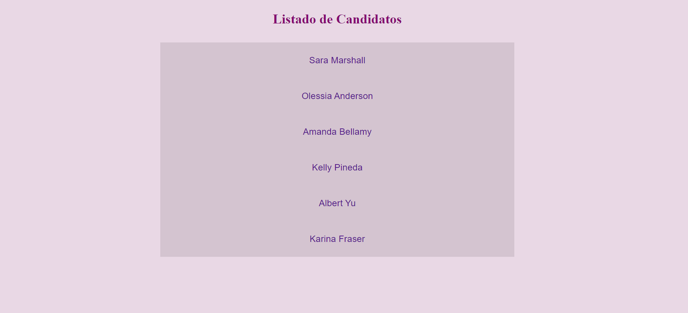
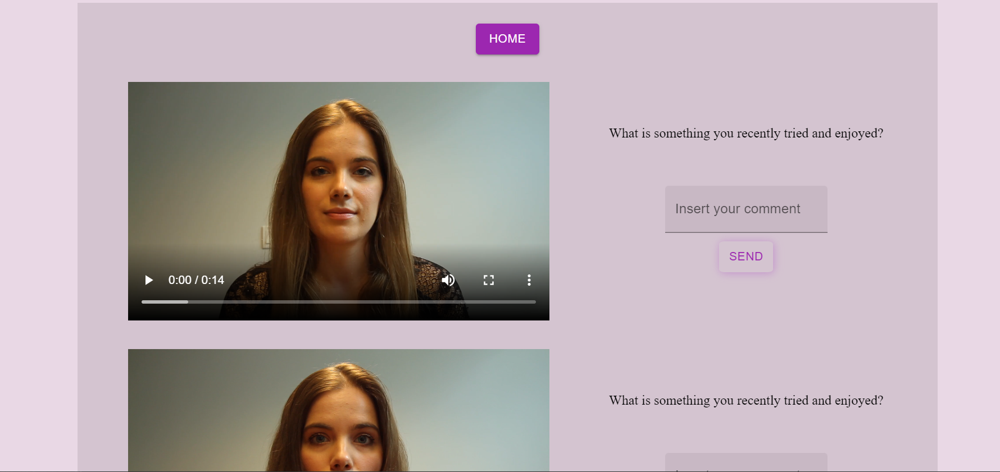

# Auxo Front-end React Coding Assessment

# react-assessment

repo back: https://github.com/auxodev/react-assessment
repo front: https://github.com/YesminArias/react-assessment

Presento una APP, a la cual trae un listado de candidatos, al seleccionar algun candidato se puede ver los videos de su aplicacion si los ha realizado.

• Un API usando json server. 
• Un Frontend cliente usando /Material UI + React + CSS

detalle de cada candidato 

para correr la aplicacion 

clonar los repositorios, instalar las dependendias con **npm install** y para correrla con **npm start**  
para front **http://localhost:3000**
para back **http://localhost:3010**

las mejoras que podria hacer serian:
- agregarles imagenes a las lista de los candidatos y detalles. 
- poder filtrar mediante una busqueda por
- mostrar el avance de los candidatos y detalles

con mas tiempo implementaria test, mejoraria la experiencia de usuario, stylos y colores. 
